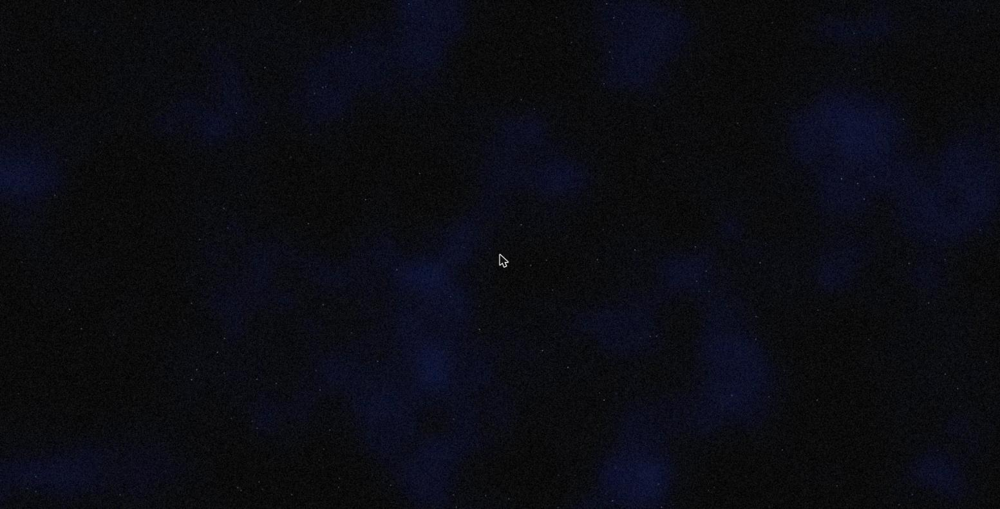
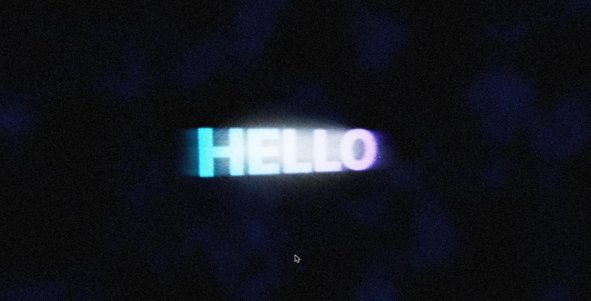
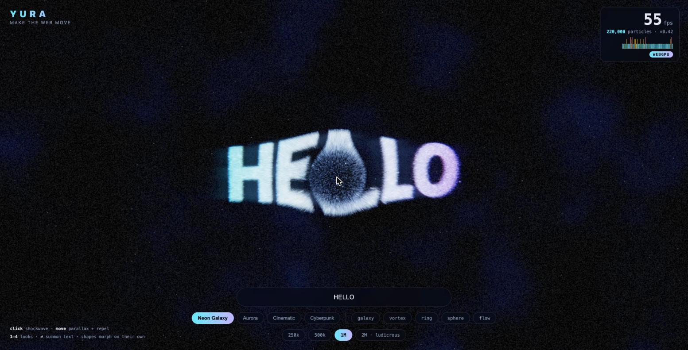
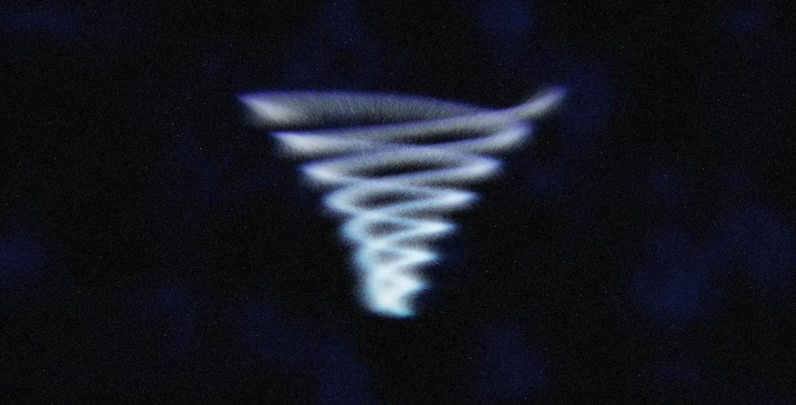
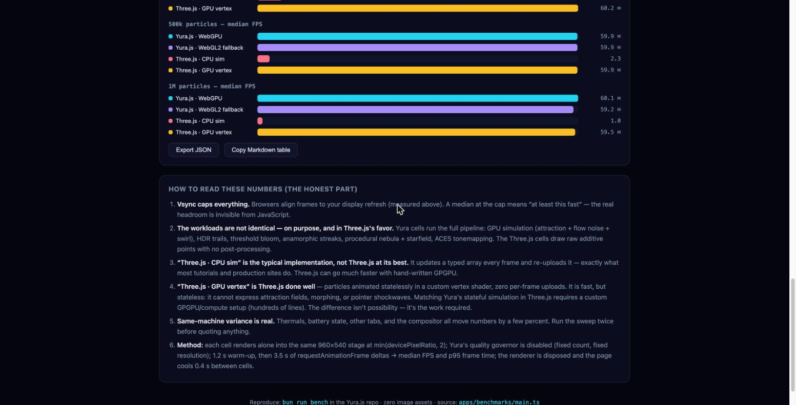

# Yura.js

**Make the web move.** Five lines. One million particles.

Yura.js is a visual-first WebGPU framework: cinematic GPU visuals for every
web developer, with safe defaults, automatic quality governance, and graceful
fallbacks. It is not a general 3D engine — it is the shortest path from an
empty `<div>` to a finished, beautiful, interactive picture. And when you
already have an engine, Yura works *with* it: the particle layer drops into
an existing Three.js scene in three lines.

```ts
import { yura } from 'yura'

yura('#hero')
  .preset('neon-galaxy')
  .interactive()
  .run()
```



## Quick start

```sh
bun install
bun dev            # hello example — 1M-particle neon galaxy
bun run showcase   # flagship demo: type a word, a million particles obey
bun run dev:game   # ORB RUSH — a complete 3D game, zero assets
bun run dev:three  # Yura particles inside a plain Three.js scene
bun run dev:lyrics # kinetic typography — timed lyrics as particle morphs
bun run dev:model  # glTF PBR demo (DamagedHelmet, drag to orbit)
bun run bench      # honest benchmarks vs Three.js, measured on YOUR machine
bun run play       # local playground server — edit, run, share snippets
bun test           # unit tests
bun run typecheck
```

## A 3D mini-game in a few lines

`yura(sel).scene()` is a zero-asset game kit: procedural PBR primitives,
physics, input, collisions, a follow camera, HUD text, and GPU particle FX —
all from one chainable API. This is the essence of the bundled ORB RUSH
example (`bun run dev:game`):

```ts
import { yura, materials } from 'yura'

const app = yura('#game')
const scene = app.scene({ gravity: -22, bounds: 12 })

scene.add('plane', { size: 24, material: 'checker' })
const player = scene.add('sphere', { radius: 0.45, material: 'chrome', body: 'dynamic', shadow: true })
scene.add('sphere', { radius: 0.26, material: materials.neon('#22d3ee'), tag: 'orb', position: [3, 1, 0] })
// ...loop this line to ring the arena with 10 orbs

const hud = scene.text('ORBS 0', { anchor: 'top' })
scene.camera.follow(player, { distance: 8, height: 3.6 })
player.trail()                                  // comet trail, one line

scene.onUpdate((dt, input) => {
  player.velocity[0] += input.x * 26 * dt
  player.velocity[2] -= input.y * 26 * dt
  if (input.jump && player.grounded) player.velocity[1] = 8.5
})

let score = 0
player.onCollide((other) => {
  if (other.tag === 'orb' && other.alive) {
    other.remove()
    scene.burst(other.position)                 // particle pop, one line
    hud.set(`ORBS ${++score}`)
    if (score === 10) scene.celebrate()         // confetti finale, one line
  }
})

app.run()
```

What you get for free:

- **Physics** — gravity, ground contact with restitution, arena bounds,
  sphere/cylinder collisions with `onCollide` callbacks and solid push-out.
- **Game-feel input** — one `input` object fed by keyboard (WASD/arrows),
  touch (drag = virtual stick, quick tap = jump), and gamepad (dead-zoned
  left stick, button 0 = jump) — largest magnitude wins, nothing to wire up.
  `input.jump` has a 150 ms jump buffer and 100 ms coyote time built in, so
  jumps feel fair without you writing timing code.
- **Sound one-liners** — `gameAudio()` gives zero-asset WebAudio effects:
  `pickup(combo)`, `jump()`, `land(intensity)`, `win()`, with `volume` and
  `mute()`; the AudioContext is created lazily on the first user gesture.
- **Follow camera** — `scene.camera.follow(obj)` with exponential smoothing;
  `scene.camera.orbit()` to hand control back.
- **Shadows** — shadow-mapped meshes plus automatic ground blob shadows.
- **Particle FX one-liners** — `scene.burst(pos)`, `obj.trail()`,
  `scene.celebrate()` render through the same GPU pipeline as everything else.
- **Zero assets** — seven procedural shapes (`sphere`, `box`, `torus`,
  `knot`, `cylinder`, `plane`, `disc`) and curated PBR materials
  (`chrome`, `gold`, `obsidian`, `checker`, `materials.neon(hex)`, …).
- **HUD** — `scene.text()` returns a handle with `set()` / `remove()`.

## Works WITH Three.js — 1M particles in your scene

Already have a Three.js scene? Keep it. `yuraLayer` puts a GPU-simulated
particle swarm on top of your render, matched to your camera every frame
(`bun run dev:three` runs the full example):

```ts
import { yuraLayer } from 'yura/three'

const fx = await yuraLayer(renderer, camera, { particles: 500_000, radius: 3.4 })
fx.attach(knot)                    // swarm follows any Object3D

renderer.setAnimationLoop(() => {
  renderer.render(scene, camera)
  fx.sync()                        // simulate + composite this frame
})
```

`sync()` does the whole job each frame: it reads your camera's
`projectionMatrix` and `matrixWorldInverse`, converts GL clip conventions to
WebGPU, anchors and scales the swarm at the attached object's world position,
steps the GPU simulation, and draws onto its own overlay canvas (screen
blending by default) above your WebGL canvas. The adaptive quality governor
runs inside it too. Morph the live swarm any time —
`fx.morphTo('YURA')` or any `ShapeSpec` — and read `fx.stats` for the
active backend, fps, and live particle count.

**Three stays YOUR dependency.** The `yura` package does not depend on
`three`: `yuraLayer` accepts structural types (anything with the right
matrix properties), so it works with whatever Three.js version your project
already uses — no peer-dependency conflicts, nothing added to your bundle
beyond Yura itself.

## Kinetic typography / lyric motion

`lyrics()` turns a list of timed lines into a particle lyric video: at each
timestamp the swarm morphs into the next line, assembling **character by
character** instead of all at once (`bun run dev:lyrics` runs this):

```ts
import { yura, lyrics } from 'yura'

const app = yura('#stage').particles(600_000).gradient('#22d3ee', '#f472b6').look('cyberpunk')
await app.run()

lyrics(app, [
  { text: 'YURA', at: 0 },
  { text: '君の声が', at: 4.2 },
  { text: '粒子のなかで\nまた君に出会う', at: 8.4 },
], {
  font: "900 240px 'Hiragino Sans', 'Noto Sans JP', system-ui, sans-serif",
  style: 'assemble',   // or 'rain' | 'explode'
  out: 'explode',      // between lines: 'dissolve' | 'explode'
  loop: true,
})
```

How the char-by-char sweep works: text shapes assign each grapheme a
contiguous band of the palette/delay coordinate in reading order, and
`app.morphNow(shape, { sweep, direction })` staggers per-particle morph
timing along that coordinate — `sweep` (0..1) sets how much of the morph is
spent sweeping, `direction` is `'ltr' | 'rtl' | 'center' | 'random'`. So
letters land one after another, and the color gradient follows the same
ordering. Graphemes are segmented with `Intl.Segmenter('ja')` when
available (Japanese-first: CJK, combining marks, and compound emoji stay
whole), with a surrogate-pair-safe fallback elsewhere.

Per line you can override `sweep`, `direction`, or substitute any
`ShapeSpec` instead of text; the run handle has `stop()` and `seek(t)`.

The underlying `shapes.text` is v2: multi-line via `'\n'`, `letterSpacing`
and `lineGap` (in em), `align: 'left' | 'center' | 'right'`, and px font
sizes auto-shrink so the text block always fits the target `worldWidth`.

## API sketch

| Surface | Highlights |
| --- | --- |
| `yura(sel)` | `.preset()` `.look()` `.model(url)` `.interactive()` `.run()`, runtime `app.morphNow('ANY WORD', { sweep, direction })` |
| `app.scene(opts)` | `add(shape, opts)`, `onUpdate(cb)`, `camera.follow/orbit`, `text()`, `each(tag, cb)`, `count(tag)`, `burst/trail/celebrate`, `input` (keyboard + touch + gamepad) |
| `SceneObject` | `position` `velocity` `spin`, `body: 'dynamic'`, `solid`, `tag`, `grounded`, `onCollide()`, `trail()`, `remove()` |
| `yuraLayer(renderer, camera, opts)` | `attach(obj)`, `at(x, y, z)`, `setRadius(r)`, `morphTo(textOrShape)`, `sync()`, `stats`, `dispose()` |
| `lyrics(app, lines, opts)` | timed lines → char-by-char particle morphs; `style: 'assemble'/'rain'/'explode'`, `out`, `loop`, per-line `sweep`/`direction`/`shape`; returns `stop()`/`seek(t)` |
| `gameAudio()` | zero-asset WebAudio SFX: `pickup(combo)` `jump()` `land(intensity)` `win()`, `volume`, `mute()`; context created lazily on first user gesture |
| `shapes` | `galaxy` `sphere` `ring` `vortex` `flow` `text` (v2: multi-line, `letterSpacing`, `align`, auto-fit) `image` |
| `looks` | `cinematic` `cyberpunk` `aurora` `neon` `studio` |
| `materials` | `matte` `plastic` `metal` `neon(hex)` + named presets (`chrome`, `gold`, `obsidian`, `checker`, …) |

## What works today (v0.1 prototype)

- **WebGPU compute particles** — up to 1,000,000 particles simulated on the
  GPU (attraction fields, flow noise, swirl, pointer forces).
- **WebGL2 fallback** — the same visual system on transform feedback +
  point sprites for browsers without WebGPU, selected automatically (or
  forced with `backend: 'webgl2'`).
- **Shape morphing** — galaxy → text → vortex transitions with turbulence
  boosts mid-flight; shapes carry a palette coordinate, so gradients sweep
  across letters and spiral arms.
- **Kinetic typography** — `lyrics()` timed-line scheduling over
  `morphNow({ sweep, direction })` char-by-char assembly; text shapes v2
  with multi-line, `letterSpacing`, `align`, auto-fit, and grapheme
  segmentation via `Intl.Segmenter` (Japanese-first).
- **HDR pipeline** — rgba16float scene target, light trails, threshold
  bloom, anamorphic streaks, chromatic aberration, ACES tonemapping,
  vignette, film grain; procedural nebula + starfield backdrop, zero assets.
- **Interaction** — hover repels particles; click detonates a shockwave.
- **glTF 2.0 / PBR** — `.model('/file.glb')` loads GLB and renders
  Cook-Torrance GGX with IBL from a procedural studio environment (no LUT,
  no HDR files), 2048² PCF shadow maps, orbit/zoom/auto-rotate controls.
- **Procedural 3D + game kit** — the `.scene()` API described above.
- **Three.js layer** — `yuraLayer` from `yura/three`, described above.
- **Quality governor** — steps resolution and particle count under frame
  budget pressure and climbs back when there is headroom, with vsync-aware
  thresholds and hitch rejection so a GC pause never costs you quality.
  Surviving particles are intensity-compensated so governed frames keep the
  same light on screen.
- **Web-native behavior** — `prefers-reduced-motion` renders a settled
  static frame; the loop pauses offscreen and on hidden tabs; device-lost
  recovers; every failure is a stable `YURA-xxx` error code with a fix
  snippet.
- **Playground** — `bun run play` starts a local server where you edit a
  snippet, run it live, and share it by URL.

| | |
| --- | --- |
|  |  |
|  |  |

## Honest performance notes

We do not print numbers we did not measure on your hardware. `bun run bench`
runs reproducible benchmarks in your browser: Yura (WebGPU and WebGL2, full
HDR pipeline) against Three.js (typical CPU-simulated points and a
hand-written GPU vertex path, both with **no** post-processing — noted on
the page, because it biases the comparison in Three's favor on fill rate).
Methodology and caveats are printed alongside the results; export to JSON or
a Markdown table.

Two things to know before you quote numbers: the quality governor may reduce
resolution or particle count on weaker GPUs (the stats readouts always show
the *live* count, not the requested one), and WebGL2 fallback performance is
substantially below WebGPU at high particle counts.

## Browser support

| Environment | What runs |
| --- | --- |
| WebGPU (Chrome/Edge 113+, Safari 26+, Firefox 141+) | Everything: particles, `.model()`, `.scene()` games, `yuraLayer` |
| WebGL2 only | Particle swarms (hello, showcase, `yuraLayer`) via the transform-feedback fallback — same HDR post. `.scene()` and `.model()` need WebGPU. |
| Neither | A static poster — never a white screen. |

## Packages

| Package | Role |
| --- | --- |
| `yura` | Public chainable API, shapes, looks, presets, `yura/three` layer |
| `@yura/core` | Math, capability detection, quality governor, lifecycle |
| `@yura/renderer-webgpu` | Compute simulation + HDR render pipeline + model renderer |
| `@yura/renderer-webgl` | WebGL2 fallback: transform-feedback sim, same HDR post |

## Roadmap

Capture to MP4/WebM, framework adapters (React/Vue/Svelte/Astro),
golden-image CI, playground fork/remix. See the product specification for
the full 90-day plan.

## License

MIT
