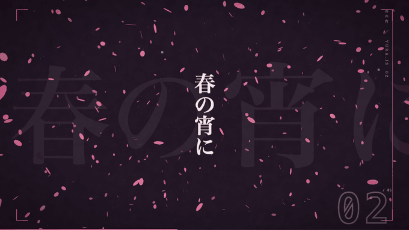
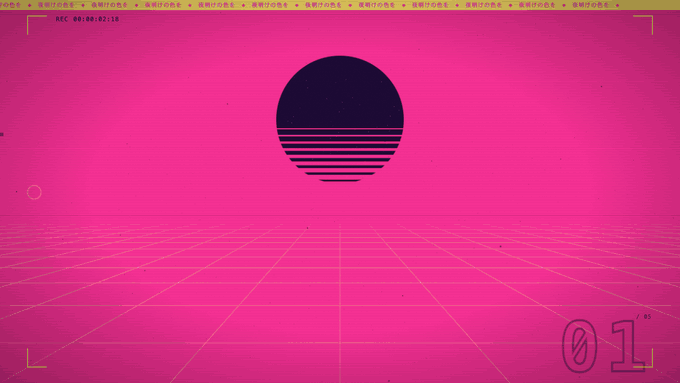
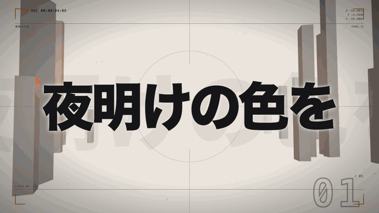
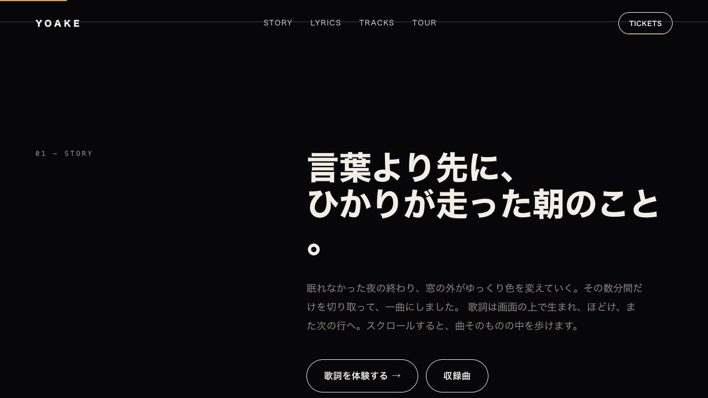
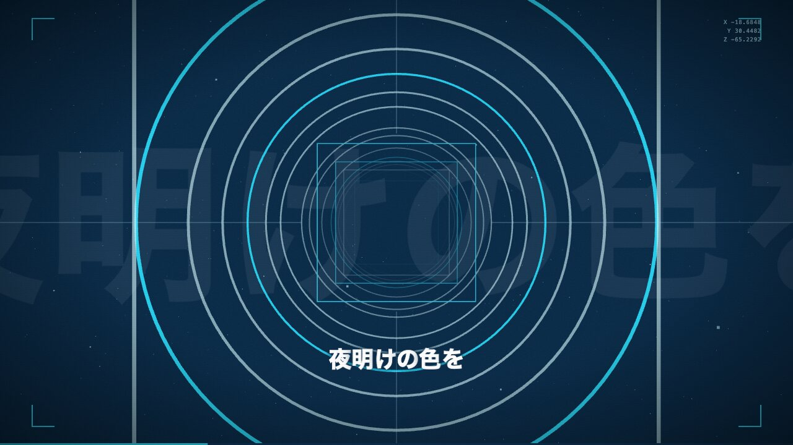
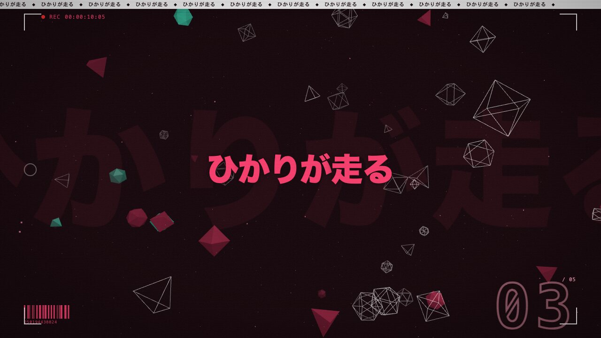
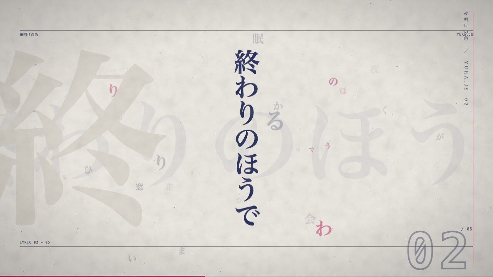
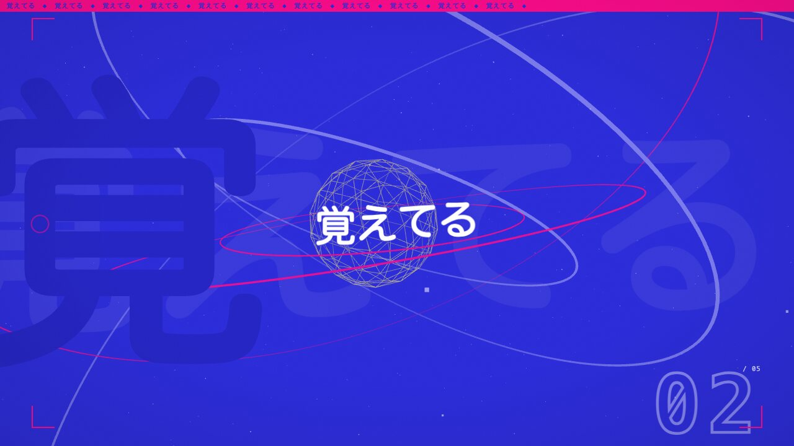
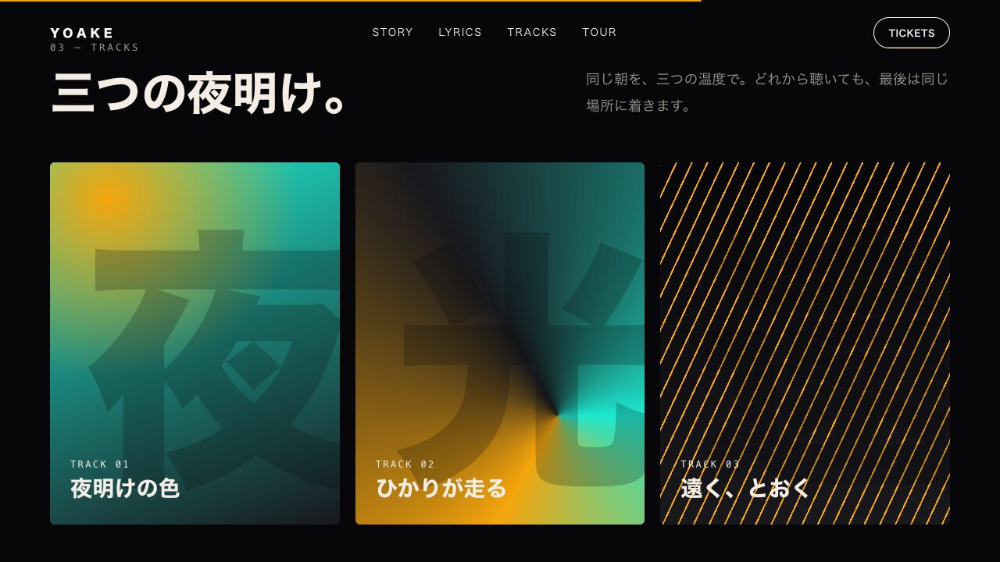
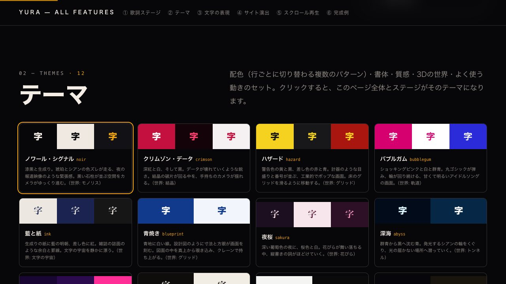

# Yura.js

[](https://github.com/tacyan/Yura.js/actions/workflows/ci.yml)
[](https://tacyan.github.io/Yura.js/)
[](https://www.npmjs.com/package/yurayura)

**Make the web move.** Two lines. One million particles.
**[▶ Live demos](https://tacyan.github.io/Yura.js/)** — showcase, lyric motion, ORB RUSH mini-game, glTF viewer, all in your browser (WebGPU).

```ts
import { yura } from 'yura'
yura('#hero').run() // a cursor-reactive million-particle galaxy. That's it.
```

Three reasons Yura is worth your `<div>`:

1. **Two lines → a million particles.** Zero config is the flagship config:
   cinematic look, adaptive quality, pointer reactivity — all on by default.
2. **A few lines → a real game or a lyric video.** Physics, coyote-time
   input (keyboard + touch + gamepad), particle FX, sound one-liners: ORB
   RUSH is ~60 lines. Kinetic Japanese-first typography via `app.lyrics()`.
3. **Zero dependencies. Three.js optional.** Yura runs entirely on its own —
   and when you *do* have a Three.js scene, `yuraLayer` composits into it in
   three lines (the adapter is duck-typed — `three` is never a dependency of `yura`).



## Install

```sh
npm install yurayura      # the npm package (import { yura } from 'yurayura')
```

Or straight from a CDN — no install, no build step:

```html
<script type="module">
  import { yura } from 'https://esm.sh/yurayura'
  yura('#hero').run()
</script>
```

Inside this repo the same package is the `yura` workspace — the examples
import `'yura'`; npm users import `'yurayura'`. Same API, same code.

## Quick start

```sh
git clone https://github.com/tacyan/Yura.js && cd Yura.js
bun install
bun dev            # hello example — 1M-particle neon galaxy
bun run showcase   # flagship demo: type a word, a million particles obey
bun run dev:lyrics # kinetic typography — timed lyrics as particle morphs
bun run dev:kinetic # DOM lyric motion — every web text effect, by name
bun run dev:stage   # lyric hero — Three.js world × kinetic lyrics, drop-in <yura-lyric-stage>
bun run dev:site    # a complete studio-grade site built only from data-yura-* attributes
bun run dev:gallery # everything above, live on one page (generated from the library's own catalogs)
bun run dev:model  # glTF PBR demo (DamagedHelmet, drag to orbit)
bun run bench      # honest benchmarks vs Three.js, measured on YOUR machine
bun run play       # local playground server — edit, run, share snippets
bun test           # unit tests
bun run typecheck
```

## A 3D mini-game in a few lines

`yura(sel).scene()` is a zero-asset game kit: procedural PBR primitives,
physics, input, collisions, a follow camera, HUD text, and GPU particle FX —
all from one chainable API — and `app.game(opts, setup)` collapses the whole
ritual (create the scene, run your setup, start the loop) into a single call.
Try it live: **[ORB RUSH](https://tacyan.github.io/Yura.js/game/)**
(this exact code, running in your browser), or locally with
`bun examples/game/index.html`. The whole game — `examples/game/main.ts`,
verbatim (the scoring helpers live next door in `score.ts`):

```ts
/**
 * ORB RUSH — the README mini-game, verbatim. Roll with WASD/arrows/drag,
 * jump with Space/tap, collect all 10 orbs. Needs WebGPU.
 */
import { yura, materials, gameAudio, type LoopHandle } from 'yura'
import { isWin, orbLabel, orbRing } from './score'

const audio = gameAudio()
const riff = ['C3', 'C4', 'G3', 'C4', 'A2', 'A3', 'E3', 'A3', 'F2', 'F3', 'C3', 'F3', 'G2', 'G3', 'D3', 'G3']
let bgm: LoopHandle | null = null
const startBgm = () => { bgm ??= audio.loop(riff, { bpm: 300, wave: 'square', gain: 0.18 }) }
window.addEventListener('pointerdown', startBgm, { once: true })
window.addEventListener('keydown', startBgm, { once: true })

yura('#game').game({ gravity: -22, bounds: 12 }, (scene) => {
  scene.add('plane', { size: 24, material: 'checker' })
  const player = scene.add('sphere', { radius: 0.45, material: 'chrome', body: 'dynamic', shadow: true })
  for (const position of orbRing()) {
    scene.add('sphere', { radius: 0.26, material: materials.neon('#22d3ee'), tag: 'orb', position })
  }

  const hud = scene.text(orbLabel(0), { anchor: 'top' })
  scene.camera.follow(player, { distance: 8, height: 3.6 })
  player.trail()                                // comet trail, one line

  scene.onUpdate((dt, input) => {
    player.velocity[0] += input.x * 26 * dt
    player.velocity[2] -= input.y * 26 * dt
    if (input.jump && player.grounded) player.velocity[1] = 8.5
  })

  let score = 0
  player.onCollide((other) => {
    if (other.tag === 'orb' && other.alive) {
      other.remove()
      scene.burst(other.position)               // particle pop, one line
      hud.set(orbLabel(++score))
      if (isWin(score)) { bgm?.stop(); audio.win(); scene.celebrate() }  // fanfare + confetti
    }
  })
})
```

What you get for free:

- **Physics** — gravity, ground contact with restitution, arena bounds,
  sphere/cylinder collisions with `onCollide` callbacks and solid push-out.
- **Game-feel input** — one `input` object fed by keyboard (WASD/arrows),
  touch (drag = virtual stick, quick tap = jump), and gamepad (dead-zoned
  left stick, button 0 = jump) — largest magnitude wins, nothing to wire up.
  `input.jump` has a 150 ms jump buffer and 100 ms coyote time built in, so
  jumps feel fair without you writing timing code.
- **Sound one-liners** — `gameAudio()` gives zero-asset WebAudio effects:
  `pickup(combo)`, `jump()`, `land(intensity)`, `win()`, with `volume` and
  `mute()`; the AudioContext is created lazily on the first user gesture.
  There's chiptune BGM too — `loop()` plays note names one beat per step
  (`null` = rest) until you call `stop()` on the handle it returns:

  ```ts
  const audio = gameAudio()
  audio.loop(['C4', 'E4', null, 'G4'], { bpm: 140 })   // wave: 'square' by default
  ```
- **Follow camera** — `scene.camera.follow(obj)` with exponential smoothing;
  `scene.camera.orbit()` to hand control back.
- **Shadows** — shadow-mapped meshes plus automatic ground blob shadows.
- **Particle FX one-liners** — `scene.burst(pos)`, `obj.trail()`,
  `scene.celebrate()` render through the same GPU pipeline as everything else,
  and `scene.gravityWell([0, 5, 0], 12)` bends them all into a black-hole zone.
  Bursts take direction when you want more than a pop, and trails take a
  color ramp, width, and fade curve:

  ```ts
  scene.burst(player.position, {
    direction: [0, 1, 0], spread: Math.PI / 6,   // cone (30° half-angle) instead of a full sphere
    shape: 'disc', radius: 0.8,                  // spawn volume: 'sphere' | 'disc' | 'box'
    colorEnd: '#7c3aed', drag: 2,                // fade to violet over life; air drag
  })
  player.trail({ color: '#4cc9f0', colorEnd: '#1e3a8a', width: 2, fade: 2 })  // cyan → deep blue tail, 2× width, quicker fade-out
  ```
- **Zero assets** — seven procedural shapes (`sphere`, `box`, `torus`,
  `knot`, `cylinder`, `plane`, `disc`) and curated PBR materials
  (`chrome`, `gold`, `obsidian`, `checker`, `materials.neon(hex)`, …).
- **HUD** — `scene.text()` returns a handle with `set()` / `remove()`.

## Works WITH Three.js — 1M particles in your scene



Already have a Three.js scene? Keep it. `yuraLayer` puts a GPU-simulated
particle swarm on top of your render, matched to your camera every frame
(try it live via `bun run play` → the “three.js” recipe):

```ts
import { yuraLayer } from 'yura/three'

const fx = await yuraLayer(renderer, camera, { particles: 500_000, radius: 3.4 })
fx.attach(knot)                    // swarm follows any Object3D

renderer.setAnimationLoop(() => {
  renderer.render(scene, camera)
  fx.sync()                        // simulate + composite this frame
})
```

`sync()` does the whole job each frame: it reads your camera's
`projectionMatrix` and `matrixWorldInverse`, converts GL clip conventions to
WebGPU, anchors and scales the swarm at the attached object's world position,
steps the GPU simulation, and draws onto its own overlay canvas (screen
blending by default) above your WebGL canvas. The adaptive quality governor
runs inside it too. Morph the live swarm any time —
`fx.morphTo('YURA')` or any `ShapeSpec` — and read `fx.stats` for the
active backend, fps, and live particle count.

**Three stays YOUR dependency.** The `yura` package does not depend on
`three`: `yuraLayer` accepts structural types (anything with the right
matrix properties), so it works with whatever Three.js version your project
already uses — no peer-dependency conflicts, nothing added to your bundle
beyond Yura itself.

## Framework adapters

React (17+): the `yura/react` subpath ships a `useYura` hook that ties the
app to the component lifecycle — mount runs `yura(el)` → your setup →
`run()`, unmount runs your cleanup → `dispose()`:

```ts
import { createElement } from 'react'
import { useYura } from 'yura/react'

function Hero() {
  const { ref, app } = useYura((app) => { app.look('cyberpunk').morphTo(['YURA']) })
  return createElement('div', { ref, style: { height: '60vh' } }) // = <div ref={ref} …/> in JSX
}
```

Like Three above, **React stays YOUR dependency** — an optional peer
(`react >= 17`), never bundled. `app` is `null` on the first render and the
live `YuraApp` once mounted; the setup callback may return a cleanup that
runs before `dispose()`.

## Kinetic typography / lyric motion



`lyrics()` turns a list of timed lines into a particle lyric video: at each
timestamp the swarm morphs into the next line, assembling **character by
character** instead of all at once (`bun run dev:lyrics` runs this):

```ts
import { yura, lyrics } from 'yura'

const app = yura('#stage').particles(600_000).gradient('#22d3ee', '#f472b6').look('cyberpunk')
await app.run()

lyrics(app, [
  { text: 'YURA', at: 0 },
  { text: '君の声が', at: 4.2 },
  { text: '粒子のなかで\nまた君に出会う', at: 8.4 },
], {
  font: "900 240px 'Hiragino Sans', 'Noto Sans JP', system-ui, sans-serif",
  style: 'assemble',   // or 'rain' | 'explode'
  out: 'explode',      // between lines: 'dissolve' | 'explode'
  loop: true,
})
```

No timestamps yet? Bare strings are sugar for `{ text }` and auto-time
themselves, one line every `every` seconds:

```ts
lyrics(app, ['君の声が', '粒子のなかで', 'また君に出会う'], { every: 3.4 })
```

Vertical Japanese? `vertical: true` lays every line out as tategaki — this
is how the showcase's sakura look runs its verses:

```ts
// glyphs sweep top to bottom; a \n inside a line adds columns, read right to left
lyrics(app, ['桜ひらひら', '春の宵に\n舞い散る'], { every: 3, vertical: true })
```

How the char-by-char sweep works: text shapes assign each grapheme a
contiguous band of the palette/delay coordinate in reading order, and
`app.morphNow(shape, { sweep, direction })` staggers per-particle morph
timing along that coordinate — `sweep` (0..1) sets how much of the morph is
spent sweeping, `direction` is `'ltr' | 'rtl' | 'center' | 'random'`. So
letters land one after another, and the color gradient follows the same
ordering. Graphemes are segmented with `Intl.Segmenter('ja')` when
available (Japanese-first: CJK, combining marks, and compound emoji stay
whole), with a surrogate-pair-safe fallback elsewhere.

### Web typography motion — `kineticLyrics()`

Particles are one way to say a lyric. The other is the way landing pages
do it: real text, split per character, revealed from masks, pulled into
focus, decoded from noise. `kineticLyrics()` plays the same timed lines as
animated DOM text over any element (or over a particle canvas), with a
vocabulary of **33 entrances, 12 holds, 22 exits and 9 layouts**, each one
named and described in words — see
[`docs/LYRIC_MOTION.md`](docs/LYRIC_MOTION.md) for the full dictionary
(`bun run dev:kinetic` previews every one):


```ts
import { kineticLyrics } from 'yura'

kineticLyrics('#stage', [
  { text: '君の声が', at: 0 },
  { text: '夜を照らす', at: 3.2, enter: 'rise', exit: 'sink' }, // mask reveal in, sink out
  { text: 'もう一度', at: 6.4, accent: true },                    // hook line: stamp / zoom + beat pulse
  { text: '縦に\n流れる', at: 9.6, layout: 'vertical' },
], { mood: 'graphic', seed: 7, bpm: 128 })
```

A **mood** (`calm`, `pop`, `glitch`, `graphic`, `editorial`, `emotional`, or
`'mix'`) plans every line's enter / hold / exit / layout from a seed — same
seed, same video — and anything you name on a line wins. Pass
`clock: () => audio.currentTime` to lock the lines to a song. Everything is
sized in em, so it reads the same on any screen; OS reduced-motion settings
switch it to plain fades automatically, and each line keeps its lyric as an
`aria-label`.

### Studio-grade sites from attributes — `yuraSite()`



The effects a studio hand-builds for a premium site — an opening loader,
split-text headings that rise out of masks, curtains that sweep across
images, velocity-reactive marquees, count-ups, magnetic buttons, a follower
cursor, the whole page recolouring section by section, and lyrics that
**play with the scroll** — as HTML attributes and one line of JavaScript.
The full attribute reference is [`docs/SITE.md`](docs/SITE.md); `examples/site`
(`bun run dev:site`) is a complete release site built with nothing else:

```html
<script>document.documentElement.classList.add('yura-js')</script>

<h1 class="yura-display" data-yura-text="rise">OUT NOW</h1>
<div data-yura-marquee>NEW SINGLE ✦ OUT NOW ✦</div>
<ul data-yura-stagger="0.1" data-yura-reveal="curtain">…</ul>
<b data-yura-counter="12.8" data-yura-suffix="M">0</b>
<section data-yura-scrub="500vh"><yura-lyric-stage>…</yura-lyric-stage></section>
```

```ts
import * as THREE from 'three'
import { yuraSite } from 'yura'

yuraSite({ theme: 'noir', three: THREE, opening: true })
```

One theme drives the page and every lyric stage (colours and type as CSS
variables, plus `yura-btn` / `yura-link` / `yura-display` utilities). It
measures everything at runtime, batches layout reads before writes in a
single frame loop, keeps split headings readable to screen readers, and
with reduced motion simply shows the finished page. Without JavaScript,
nothing is hidden. `bun run dev:gallery` shows every feature live on one page.

### Lyric stage — Three.js × lyric motion, drop-in

| | |
| --- | --- |
|  |  |

`lyricStage()` builds a whole lyric hero from one call, and
`<yura-lyric-stage>` makes it a tag you paste into any page. Every line is
a *cut*: the colour scheme swaps, the camera makes a new move through a
Three.js world, a transition wipes the frame, and the words arrive with the
kinetic vocabulary above — framed by HUD / editorial decor and finished with
grain, scanlines and accent flashes. **12 themes, 7 worlds, 11 camera moves,
9 transitions and 14 decor marks**, all documented in
[`docs/LYRIC_MOTION.md`](docs/LYRIC_MOTION.md) (`bun run dev:stage`):

```html
<script type="module">
  import * as THREE from 'three'
  import { defineLyricStage } from 'yura'
  defineLyricStage({ three: THREE })
</script>

<yura-lyric-stage theme="synthwave" bpm="128" song="Song" artist="Artist">
  <p>夜明けの色を</p>
  <p data-accent>ひかりが走る</p>
</yura-lyric-stage>
```

Like the Three adapter, the stage never imports `three` — you hand it your
own namespace (omit it for a CSS backdrop; a missing WebGL falls back the
same way with `YURA-021`). It sizes itself from its box at runtime, fits
long lines, pauses off screen, keeps the source lyrics in the page for
search engines and screen readers, and honours reduced-motion settings.

The choreography itself is tunable: `.motion()` retimes the automatic shape
cycle app-wide, `morphNow` overrides per call, and `ease` takes a name from
the `eases` registry (`cubic`, `expo`, `back`, `smooth`, `linear`) or any
custom `f(0)=0, f(1)=1` function:

```ts
app.motion({ hold: 2.2, morph: 1.4, ease: 'expo' })   // automatic shape cycle
app.morphNow(shapes.helix({ turns: 5 }), { duration: 0.8, ease: 'back' })
app.motion({ turbulence: 0.8, turbulenceScale: 0.35 }) // organic fluid drift
app.motion({ attractors: [{ position: [4, 0, 0], strength: 30 },    // gravity well
                          { position: [-4, 0, 0], strength: -20 }] }) // repulsor
```

The same call tunes the physics: `turbulence` adds divergence-free curl
noise — fluid-like swirls with zero clumping — and at the default `0` the
term vanishes from the shader math, so it costs nothing until you turn it on.
`attractors` pins up to 4 softened inverse-square gravity wells on the swarm
(`radius` widens the calm core, negative `strength` repels), and the empty
default skips that term the same way — free until you place one.

Physics keys you set through `.motion()` are sticky: a later `.preset()`
still swaps in its own motion defaults, but every key you set explicitly
survives the swap — so `.motion({ turbulence: 0.8 }).preset('aurora')` and
`.preset('aurora').motion({ turbulence: 0.8 })` end up identical.

(`shapes.box()`, `shapes.cone()`, and `shapes.helix()` are morph targets too,
next to `galaxy`, `sphere`, `ring`, `vortex`, `flow`, `text`, and `image`.)

Per line you can override `sweep`, `direction`, or substitute any
`ShapeSpec` instead of text; the run handle has `stop()` and `seek(t)`.

The underlying `shapes.text` is v2: multi-line via `'\n'`, `letterSpacing`
and `lineGap` (in em), `align: 'left' | 'center' | 'right'`, and px font
sizes auto-shrink so the text block always fits the target `worldWidth`.

## API sketch

| Surface | Highlights |
| --- | --- |
| `yura(sel)` | `.preset()` `.look()` `.motion({ hold, morph, ease })` `.morphTo(seq)` `.model(url)` `.game(opts, setup)` `.interactive()` `.run()`, runtime `app.morphNow('ANY WORD', { sweep, direction, duration, ease })`, `app.onStats(cb)`, `app.frames(n)` |
| `app.scene(opts)` | `add(shape, opts)`, `onUpdate(cb)`, `camera.follow/orbit`, `text()`, `each(tag, cb)`, `count(tag)`, `burst/trail/celebrate/gravityWell`, `fx` (raw `FxPool`), `input` (keyboard + touch + gamepad) |
| `SceneObject` | `position` `velocity` `spin`, `body: 'dynamic'`, `solid`, `tag`, `grounded`, `onCollide()`, `onLand()`, `trail()`, `remove()` |
| `yuraLayer(renderer, camera, opts)` | `attach(obj)`, `at(x, y, z)`, `setRadius(r)`, `motion(m)`, `morphTo(textOrShape)`, `sync()`, `stats`, `dispose()` |
| `lyrics(app, lines, opts)` | timed lines (or bare strings auto-timed `every` seconds apart) → char-by-char particle morphs; `style: 'assemble'/'rain'/'explode'`, `out`, `loop` (with `loopTail` hold), per-line `sweep`/`direction`/`shape`; returns `stop()`/`seek(t)` |
| `kineticLyrics(target, lines, opts)` | timed lines → animated DOM text; `mood` + `seed` planning, per-line `enter`/`hold`/`exit`/`layout`/`accent`, `bpm`, `clock` (song sync), `loop`; returns `stop()`/`seek(t)`/`render(t)`. Vocabulary in `motions` / `kineticCatalog()` |
| `lyricStage(target, lines, opts)` / `defineLyricStage({ three })` | lyric hero: Three.js world + kinetic lyrics + decor + transitions + texture on one clock; `theme`, `world`, `camera`, `transition`, `decor`, `bpm`, `audio`/`clock`, `seed`; `<yura-lyric-stage>` custom element; returns `stop()`/`seek(t)`/`render(t)` |
| `yuraSite(opts)` | page-level motion from `data-yura-*` attributes: text / block reveals, stagger, marquee, parallax, counter, magnetic, cursor, scheme sections, scroll-scrubbed lyric stages, opening loader, progress bar; `setTheme()` / `refresh()` / `destroy()` |
| `gameAudio()` | zero-asset WebAudio SFX: `pickup(combo)` `jump()` `land(intensity)` `win()`, chiptune-style BGM `loop(pattern, { bpm, wave, gain })`, `volume`, `mute()`; context created lazily on first user gesture |
| `shapes` | `galaxy` `sphere` `ring` `vortex` `flow` `box` `cone` `helix` `text` (v2: multi-line, `letterSpacing`, `align`, auto-fit) `image` |
| `looks` | `cinematic` `cyberpunk` `aurora` `neon` `studio` `sakura` — each takes `Partial<LookParams>` overrides, e.g. `neon({ blendMode: 'alpha', toneMapping: 'reinhard' })` |
| `eases` | named morph curves `cubic` `expo` `back` `smooth` `linear` for `.motion({ ease })` / `morphNow({ ease })`; any `f(0)=0, f(1)=1` function is also accepted |
| `materials` | `matte` `plastic` `metal` `neon(hex)` + named presets (`chrome`, `gold`, `obsidian`, `checker`, …) |

## What works today (v0.1 prototype)

- **WebGPU compute particles** — up to 1,000,000 particles simulated on the
  GPU (attraction fields, flow noise, swirl, pointer forces).
- **WebGL2 fallback** — the same visual system on transform feedback +
  point sprites for browsers without WebGPU, selected automatically (or
  forced with `backend: 'webgl2'`).
- **Shape morphing** — galaxy → text → vortex transitions with turbulence
  boosts mid-flight; shapes carry a palette coordinate, so gradients sweep
  across letters and spiral arms.
- **Kinetic typography** — `lyrics()` timed-line scheduling over
  `morphNow({ sweep, direction })` char-by-char assembly; text shapes v2
  with multi-line, `letterSpacing`, `align`, auto-fit, and grapheme
  segmentation via `Intl.Segmenter` (Japanese-first).
- **Studio-grade sites** — `yuraSite()`: reveals, marquees, counters,
  magnetic buttons, cursor, section recolouring and scroll-played lyrics,
  all from HTML attributes.
- **Lyric stage** — `lyricStage()` / `<yura-lyric-stage>`: a Three.js
  world, per-line colour-scheme cuts, camera moves, transitions, decor and
  film texture around kinetic lyrics, from one tag.
- **Web typography motion** — `kineticLyrics()` renders lyrics as DOM text
  with 76 named, documented motions (mask reveals, shutters, scramble,
  neon, beat pulses, tategaki…) and six seed-planned moods.
- **HDR pipeline** — rgba16float scene target, light trails, threshold
  bloom, anamorphic streaks, chromatic aberration, ACES tonemapping,
  vignette, film grain; procedural nebula + starfield backdrop, zero assets.
  Particle blending and tone mapping are look params, so every look preset
  accepts them as overrides:

  ```ts
  app.look(looks.neon({ blendMode: 'alpha', toneMapping: 'reinhard' }))
  // blendMode: 'additive' | 'alpha' | 'screen' · toneMapping: 'aces' | 'reinhard' | 'linear'
  ```

  `softParticles` is a look param too: a world-unit depth-fade so scene-mode
  FX sprites melt into nearby geometry instead of clipping (the `sakura`
  look ships with it on; the default 0 keeps it off at zero cost).
  So is bokeh depth of field: the focal plane stays sharp while out-of-focus
  sprites bloom into discs — free at the default 0:

  ```ts
  app.look(looks.cinematic({ dofStrength: 1.2 }))
  // dofFocus picks the sharp plane; the default 26 is the camera's orbit radius
  ```
- **Interaction** — hover repels particles; click detonates a shockwave.
  `.interactive({ gravity: 40 })` upgrades the cursor to a live gravity well
  that pulls the whole swarm toward the pointer (negative values repel).
- **glTF 2.0 / PBR** — `.model('/file.glb')` loads GLB and renders
  Cook-Torrance GGX with IBL from a procedural studio environment (no LUT,
  no HDR files), 2048² PCF shadow maps, orbit/zoom/auto-rotate controls.
- **Procedural 3D + game kit** — the `.scene()` API described above.
- **Three.js layer** — `yuraLayer` from `yura/three`, described above.
- **Quality governor** — steps resolution and particle count under frame
  budget pressure and climbs back when there is headroom, with vsync-aware
  thresholds and hitch rejection so a GC pause never costs you quality.
  Surviving particles are intensity-compensated so governed frames keep the
  same light on screen.
- **Stats HUD one-liner** — `app.onStats((_, text) => { hud.textContent = text })`
  calls back every 500 ms with live `YuraStats` plus the preformatted
  `formatStats` string; `app.frames(120)` returns recent frame times in ms
  for a sparkline. `onStats` returns a stop function, and every subscription
  ends on `dispose()`.
- **Web-native behavior** — `prefers-reduced-motion` renders a settled
  static frame; the loop pauses offscreen and on hidden tabs; device-lost
  recovers; every failure is a stable `YURA-xxx` error code with a fix
  snippet.
- **Playground** — `bun run play` starts a local server where you edit a
  snippet, run it live, and share it by URL.

| | |
| --- | --- |
|  |  |
|  |  |

## Honest performance notes

We do not print numbers we did not measure on your hardware. `bun run bench`
runs reproducible benchmarks in your browser: Yura (WebGPU and WebGL2, full
HDR pipeline) against Three.js (typical CPU-simulated points and a
hand-written GPU vertex path, both with **no** post-processing — noted on
the page, because it biases the comparison in Three's favor on fill rate).
Methodology and caveats are printed alongside the results; export to JSON or
a Markdown table.

Two things to know before you quote numbers: the quality governor may reduce
resolution or particle count on weaker GPUs (the stats readouts always show
the *live* count, not the requested one), and WebGL2 fallback performance is
substantially below WebGPU at high particle counts.

## Browser support

| Environment | What runs |
| --- | --- |
| WebGPU (Chrome/Edge 113+, Safari 26+, Firefox 141+) | Everything: particles, `.model()`, `.scene()` games, `yuraLayer` |
| WebGL2 only | Particle swarms (hello, showcase, `yuraLayer`) via the transform-feedback fallback — same HDR post. `.scene()` and `.model()` need WebGPU. |
| Neither | A static poster — never a white screen. |

Hit a `YURA-xxx` code in the console? Every code is documented in the [error code reference](docs/ERRORS.md).

## Packages

| Package | Role |
| --- | --- |
| `yura` | Public chainable API, shapes, looks, presets, `yura/three` layer |
| `@yura/core` | Math, capability detection, quality governor, lifecycle |
| `@yura/renderer-webgpu` | Compute simulation + HDR render pipeline + model renderer |
| `@yura/renderer-webgl` | WebGL2 fallback: transform-feedback sim, same HDR post |

## Roadmap

Capture to MP4/WebM, more framework adapters (Vue/Svelte/Astro),
golden-image CI, playground fork/remix. See the product specification for
the full 90-day plan.

## License

MIT
